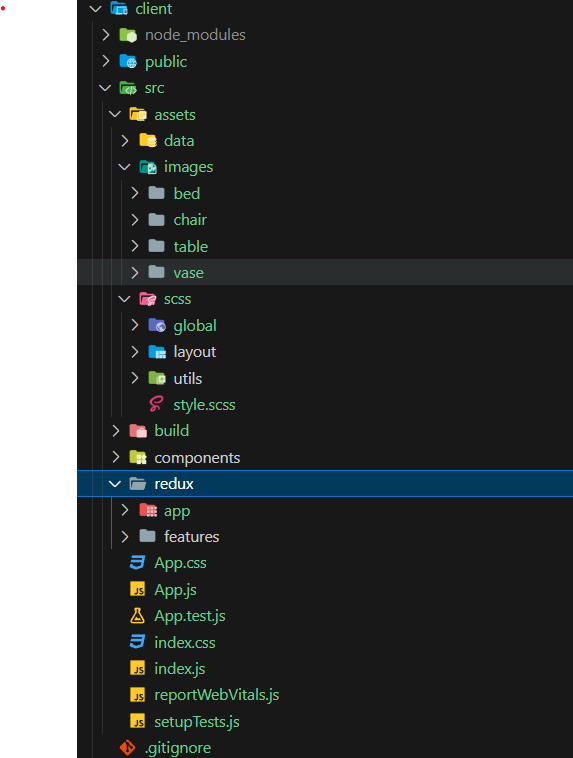
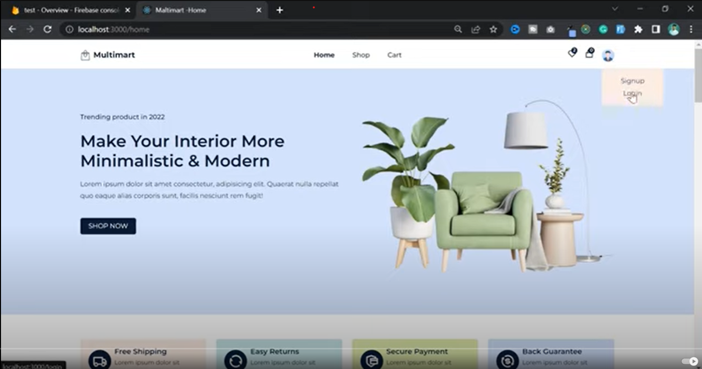

`npm install react-icons --save`

`npm install reactstrap react react-dom`
`npm install --save bootstrap`





start of code

create pages folder
add home, shop, cart, productDetails, checkout, login, signup

create routers folder > Routers.js > add the above pages using react-router-dom

create Header and footer folder  and Layout Folder.

# Header


new learn -

to make one of the selected item to apply specif class we can pass fn to className

```js 
 {
                    nav_links.map((item, index) =>
                    (<li key={index} >
                      <NavLink to={item.path} className={(navClass) => navClass.isActive ? "navigation__active" : ""}>{item.name}</NavLink>
                    </li>
                    ))
                  }
```

# title change -Not worked


# home page

## banner
## services
- new learn
in order to pass class Name for icons that is getting rendered through map fnwe can do this

`{React.cloneElement(items.icon, { className: 'services__items__icons' })}`

```js  
{
                            serviceData.map((items, index) => (
                                <Col lg="3" md="4" key={index}>
                                    <div className='services__items'>
                                        
                                            {React.cloneElement(items.icon, { className: 'services__items__icons' })}
                                        
                                        <div>
                                            <h3>{items.title}</h3>
                                            <p>{items.desc}</p>
                                        </div>
                                    </div>
                                </Col>
                            ))
                        }
```
## trending products

## best sales

